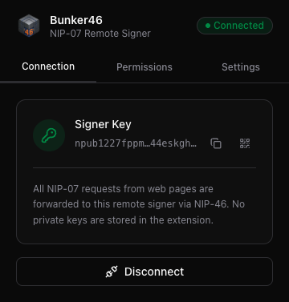
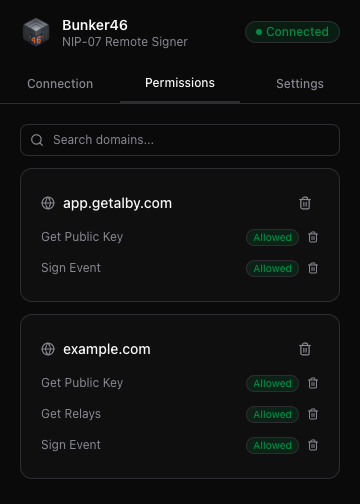
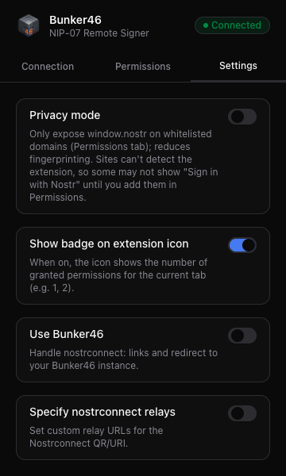
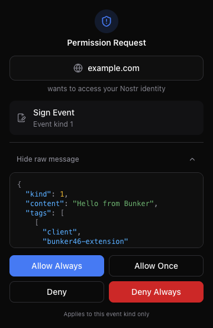

# Bunker46 Extension

[](https://github.com/dsbaars/bunker46-extension/actions/workflows/ci.yml)
[](https://opensource.org/licenses/MIT)
[](https://chrome.google.com/webstore)
[](https://addons.mozilla.org/nl/firefox/addon/bunker46/)

A **NIP-07 compliant** browser extension that exposes `window.nostr` to web pages. Instead of storing private keys in the browser, it forwards every signing request to a remote [NIP-46](https://nips.nostr.com/46) signer (such as [Bunker46](https://github.com/dsbaars/bunker46)) over Nostr relays.

## What it does

- **NIP-07 provider** — Injects `window.nostr` (getPublicKey, signEvent, getRelays, nip04/nip44) so Nostr apps can request signatures without holding keys locally.
- **Remote signer** — Connect with a `bunker://` URI or via **nostrconnect**: the extension shows a QR and copyable URI for your bunker app to scan; once connected, the session is saved so you stay connected after restart.
- **Per-domain permissions** — Each site must be allowed (once or always) before it can use your Nostr identity; you can revoke domains or individual methods from the Permissions tab.
- **Privacy mode** — When enabled (Settings), `window.nostr` is only exposed on domains you add to a whitelist, reducing fingerprinting; add or remove domains from the Permissions tab.
- **Extension icon badge** — Optional (Settings): show the number of granted permissions for the current tab on the extension icon.
- **Full logout** — Disconnect asks for confirmation and then disconnects, clears all permissions, and clears the privacy whitelist in one step.
- **nostrconnect:// links** — Clicking nostrconnect links opens your configured Bunker46 instance so you can add or manage connections there.
- **Chrome & Firefox** — Built with [WXT](https://wxt.dev); Chrome and Firefox (MV3) builds are supported.

## Screenshots

| Connection                                                                                        | Permissions                                                                                          | Settings                                                                                    |
| ------------------------------------------------------------------------------------------------- | ---------------------------------------------------------------------------------------------------- | ------------------------------------------------------------------------------------------- |
| [](docs/screenshots/popup-connection.png) | [](docs/screenshots/popup-permissions.png) | [](docs/screenshots/popup-settings.png) |

**Permission prompt** (when a site requests NIP-07 access):

[](docs/screenshots/prompt-permission.png)

## Development

```bash
pnpm install
pnpm run dev          # Chrome
pnpm run dev:firefox  # Firefox (MV3)
```

## Build

```bash
pnpm run build         # .output/chrome-mv3/
pnpm run build:firefox # .output/firefox-mv3/
pnpm run zip           # Pack Chrome build
pnpm run zip:firefox   # Pack Firefox build
```

Load the relevant `.output/<target>/` directory (or the zip) as an unpacked extension in Chrome or Firefox.

## Project layout

- `entrypoints/` — Background script, content script (NIP-07 bridge + nostrconnect), popup, permission prompt, redirect page.
- `public/` — Injected NIP-07 provider script and extension icons.
- `lib/` — Permissions storage, privacy-mode whitelist, NIP-07 types, hex helpers.
- `components/ui/` — Vue UI components (shadcn-style).

## License

MIT — see [LICENSE](LICENSE).
